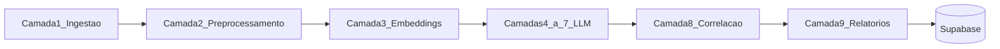

# Arquitetura do Motor

## Visão geral

O motor executa um pipeline batch diário que transforma documentos brutos em um índice escatológico consolidado, persistido no Supabase.



## Motores hierárquicos

| Nível | Frequência | Entrada | Saída |
|-------|------------|---------|-------|
| **Nível 1** | Diário | Textos brutos (24h) | `resultados_escatologicos` |
| **Nível 2** | Semanal → anual | Delta JSON agregado (Motor 1) | `snapshots_periodo` (`weekly`, `monthly`, `quarterly`, `semiannual`, `annual`) |
| **Nível 3** | Trimestral/semestral/anual | Snapshots Nível 2 + RAG teológico (Camada 3) + LLM hermenêutico | `snapshots_periodo` (`*_hybrid`) |

### Janelas temporais (doc)

| Janela | Papel | Motor |
|--------|-------|-------|
| Semanal | Tática — filtro de ruído | Nível 2 |
| Mensal | Estratégica — convicção Bayesiana | Nível 2 |
| Trimestral/Semestral | Ciclos — aceleração de transição | Nível 2 + Nível 3 (`quarterly_hybrid`, `semiannual_hybrid`) |
| Anual | Panorama — mapa da transição entre eras | Nível 2 + Nível 3 (`annual_hybrid`) |

CLI:

```bash
python -m motor.cli run-synthesis --window monthly
python -m motor.cli run-hybrid-analysis --window annual
```

## Camadas

### 1 — Ingestão
- RSS (`config/feeds.yaml`) — geopolítica + UFO/disclosure + engano apocalíptico
- GDELT API (inclui UAP/disclosure e narrativas de engano)
- ACLED (stub, API key opcional)
- Dedup por `content_hash`

### 2 — Pré-processamento
- Limpeza HTML, normalização
- Chunking 800 chars, overlap 10%
- Tags de tópico heurísticas

### 3 — Embeddings
- BGE-M3 (`sentence-transformers`) ou fallback hash
- pgvector para busca semântica
- RAG teológico (`corpus_teologico`)

### 4–7 — LLM (Groq + fallback OpenRouter)
- **4:** extração JSON estruturada
- **5:** linha temporal
- **6:** raciocínio SE/ENTÃO
- **7:** hermenêutica com RAG bíblico

### 8 — Correlação
- Bayes (convicção sequencial)
- HMM + Viterbi (fases I–IV)
- Falso líder (incongruência discurso vs estrutura)
- Scores besta mar / terra
- MCDA Top-10

### 9 — Relatórios
- HTML via Jinja2 embutido no JSON
- Rankings e métricas para dashboard

## GNN v1

Centralidade via **NetworkX** como proxy de message-passing. Tabelas `grafo_nos` e `grafo_arestas` prontas para migração futura para PyG/DGL.

## Idempotência

`run-daily` ignora datas já processadas, exceto com `--force`. Falhas na Camada 8 impedem publicação de fase com `status: partial`.
